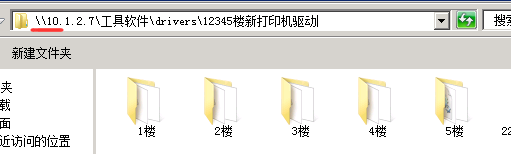
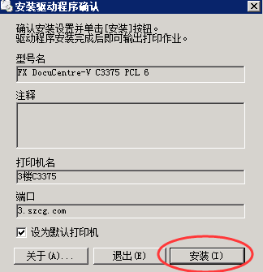
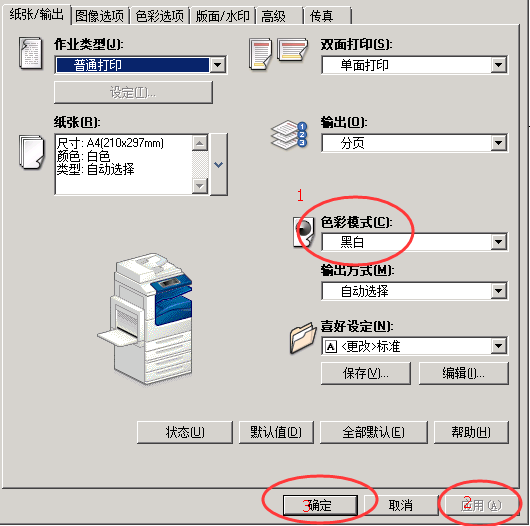

#3375打印机驱动安装指引#
---

>5号楼1-4楼均为3375打印机，5楼为2265打印机，请根据楼层安装不同的驱动，同时可以设置后支持漫游打印机，即打印作业发送到期中一台打印机，可以从其他任意打印机打印作业

**驱动程序位置：**

	在我的电脑地址栏中输入file://10.1.2.7 或者\\10.1.2.7 回车，用户名public 密码888888
	驱动路径为：\\10.1.2.7\工具软件\drivers\12345楼新打印机驱动 
**安装方法：**

按楼层复制相应文件夹到***计算机本地目录*** 中

打开驱动文件夹，双击**EzInst**进入目录，找到**setup.exe**，双击后弹出 **打开文件-安全警告** 提示框，单击**运行**，单击**安装**等待片刻即可

安装完成后需要设置默认打印颜色为黑白，设置方法为在打印机驱动上右键，选择打印首选项，在色彩模式那选择黑白，保存即可

