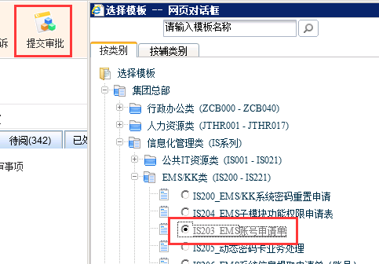
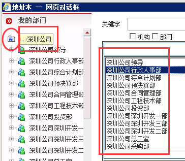

#如何申请新员工的EMS帐号
---
    
- 登录EMS网站
- 提交审批流程
- 填写相关资料，待审批通过即可

###1. 登录EMS网站
点击[EMS](http://ems.evergrande.com "恒大综合管理系统")登录系统
###2. 提交审批
点击系统中导航栏里的**提交审批**，按如下路径选择流程表单（流程路径为：集团总部-->信息化管理类-->EMS/KK类-->IS203_EMS帐号申请单）

###3. 按表单要求填写资料
####注意事项：
- 此流程将同时申请EMS帐号和KK帐号
- EMS、KK的密码是各自独立的，系统初始密码为123456,修改其中一个的密码，另外一个不会跟着改变
- 流程结束时EMS帐号即时生效，但KK帐号须在每天中午12点05分同步产生，如上午流程通过，当天中午后即可使用，如果流程是下午通过的，则KK帐号必须第二天中午后才可以使用
- 选择所在部门时须注意，默认打开后只能选择部门中层这一部门，如是申请普通员工帐号，则需要点击向上的按钮，然后选中***深圳公司***，此时右边的待选框中才会出现部门选择项，双击所在部门即可
   
