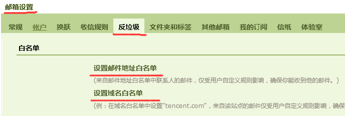
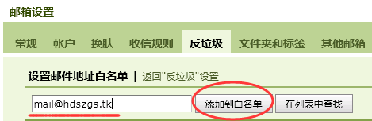
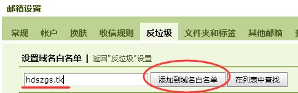

#QQ邮箱设置白名单的方法#
>白名单的作用：将一个邮件地址添加到白名单后，该地址发来的信件将不受反垃圾规则的影响，保证您一定能收到来自该地址的邮件。

---

**添加邮件地址白名单的设置方法：**

* 1.在“邮箱设置”->“反垃圾”->“白名单”栏目中，点击“设置邮件地址白名单”

	

* 2.输入完整的地址，如“mail@hdszgs.tk”，然后点击“添加到白名单”按钮，即可

	

**添加域名白名单的设置方法**

* 1.在“邮箱设置”->“反垃圾”->“白名单”栏目中，点击“设置域名白名单”

	

* 2.输入一个域名，如“hdszgs.tk”，然后点击“添加到白名单”按钮即可

	

**注意：**

	公司打印机扫描邮件采用“mail@hdszgs.tk”邮箱发送
	如果收不到扫描件，请按上述方法把“mail@hdszgs.tk”加到邮件地址白名单中，把“hdszgs.tk”加入到域名白名单中。