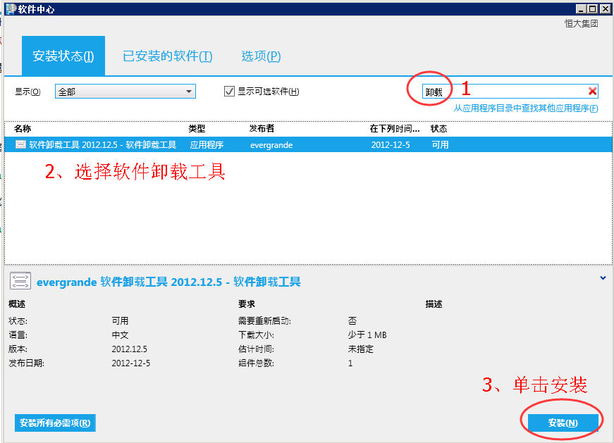
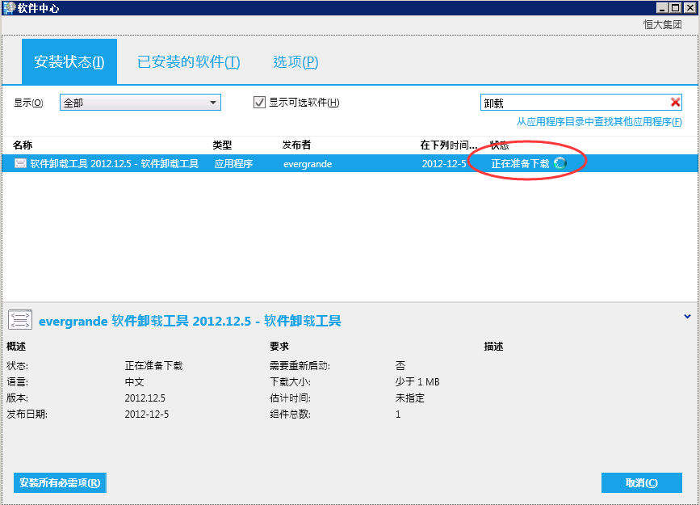
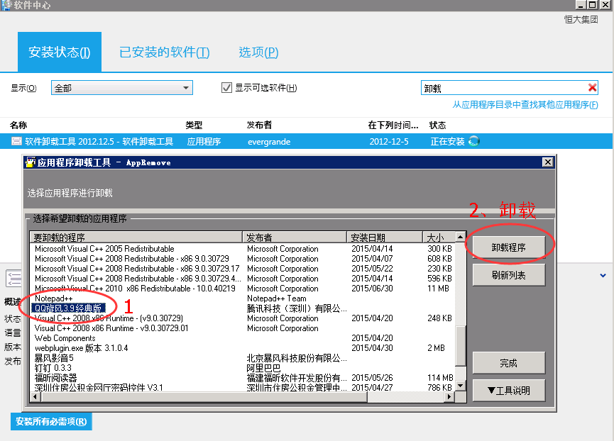

#加域计算机如何卸载软件#

>很多加域的计算机无管理员权限，无法在控制面板中正常卸载软件，需要通过“软件中心”中的特殊工具进行卸载

---

* 1.单击“开始”--选择“所有程序”

	

* 2.如图所示，打开“软件中心”

	

* 3.在软件中心中搜索“软件卸载工具”，选中后单击“安装”

	

* 4.此时软件卸载工具会进行下载，下载完成后会安装并弹出软件卸载界面，在软件列表中选择须卸载的软件，然后单击“卸载程序”即可正常卸载软件

	

	

