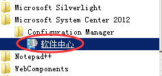
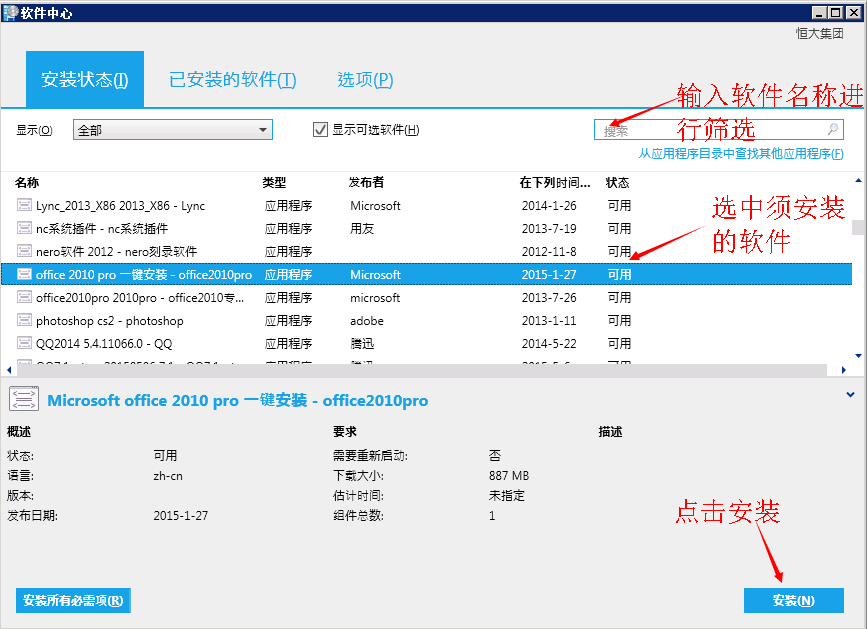

#加域计算机如何安装软件#

>很多的加域的计算机无管理员权限，此时无法通过软件安装包进行安装，只能通过软件中心进行常用软件的安装

---

* 1.单击“开始”--选择“所有程序”

	

* 2.如图所示，打开“软件中心”

	

* 3.在软件中心可找到日常办公所需软件，选择软件，单击右下角的“安装”即可开始下载，下载完成后自动开始安装步骤，后续安装步骤和双击安装包安装无异

	

