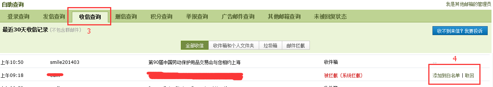

#扫描邮件收不到该怎么办？#

>由于打印机扫描件发送量巨大，导致邮箱运营商不断屏蔽公司打印机发件箱，导致大量扫描邮件收不到，大家可参考下面的步骤设置下邮箱白名单规则，有助于缓解目前情况。公司内部有邮件系统，不受外部邮箱运营商影响，有需要的可以更换。

---

**查询邮件是否被运营商屏蔽的方法：**

* 1.进入QQ邮箱，点击邮箱首页-->自助查询-->收件查询，将被系统拦截的打印机发送的邮件添加到白名单，下次扫描就可以收到了，同时可查看垃圾箱中是否有收到邮件
	

	

* 2.QQ邮箱设置白名单的方法：

	[QQ邮箱设置白名单的方法](http://doc.hdszgs.tk/QQ邮箱设置白名单的方法.html)