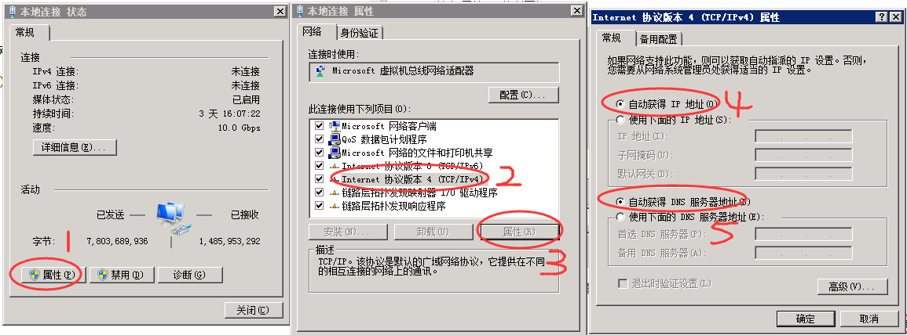

#设置计算机自动获取IP地址#

---

* 1.单击“开始”，“控制面板”

	

* 2.在弹出的控制面板页面单击“查看网络状态和任务”

	

* 3.在弹出的页面单击“本地连接”

	

* 4.单击“属性”（--1），在弹出的“本地连接 属性”页中选择“Internet 协议版本 4”（--2）后单击“属性”（--3），然后勾选“自动获得 IP 地址”（--4）和“自动获得 DNS 服务器地址”（--5），最后单击全部的“确定”即可

	