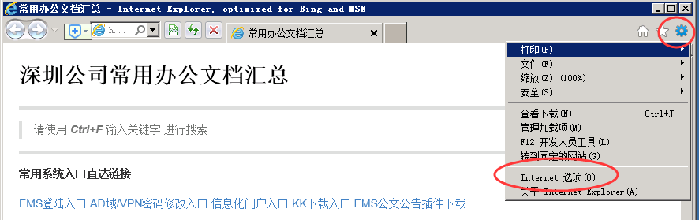
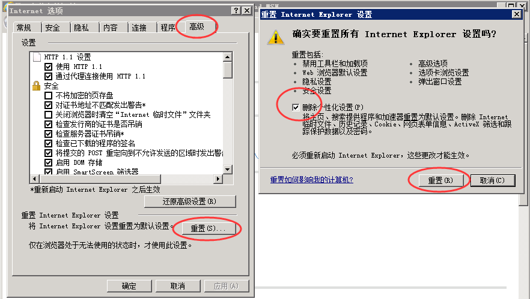

#重置IE浏览器的方法#

>有些时候我们的IE浏览器会出现一些想不到的问题，我们又不知道该如何解决的时候，重置IE浏览器的设置是一个非常不错的方法。重置IE浏览器可以让我们的浏览器恢复到最初的样子，下面介绍如何恢复IE浏览器的设置。

---

* 1.打开IE，单击如下图所示图标，在弹出菜单中选择“Internet 选项”

	
* 2.在“Internet 选项”中选择“高级”选项卡，单击“重置”（左图中的），勾选“删除个性化设置”前面的单选框，然后单击“重置”（有图中的）即可

	
